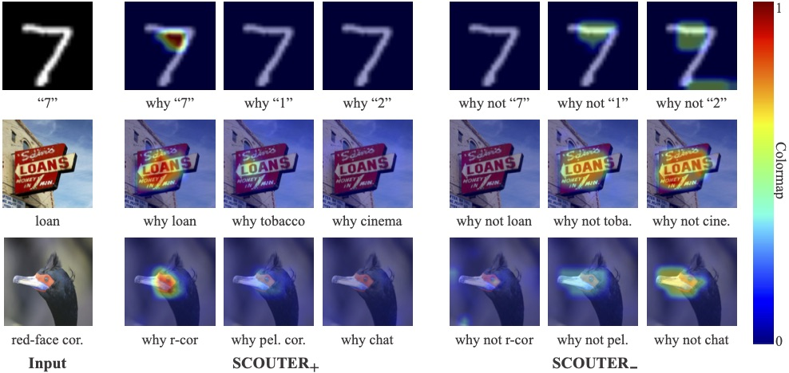

# SCOUTER: Slot Attention-based Classifier for Explainable Image Recognition 
[PDF](https://arxiv.org/abs/2009.06138)



## Abstract
Explainable artificial intelligence has been gaining attention in the past few years. However, most existing methods are based on gradients or intermediate features, which are not directly involved in the decision-making process of the classifier. In this paper, we propose a slot attention-based classifier called SCOUTER for transparent yet accurate classification. Two major differences from other attention-based methods include: (a) SCOUTER's explanation is involved in the final confidence for each category, offering more intuitive interpretation, and (b) all the categories have their corresponding positive or negative explanation, which tells "why the image is of a certain category" or "why the image is not of a certain category." We design a new loss tailored for SCOUTER that controls the model's behavior to switch between positive and negative explanations, as well as the size of explanatory regions. Experimental results show that SCOUTER can give better visual explanations while keeping good accuracy on small and medium-sized datasets.

## Model Structure


SCOUTER is built on top of the recently-emerged slot attention, which offers an object-centric approach for image representation. Based on this approach, we propose an explainable slot attention (xSlot) module. The output from the xSlot module is directly used as the confidence values for each category and thus commonly used fully-connected (FC) layer-based classifiers are no longer necessary. The whole network, including the backbone, is trained with the SCOUTER loss, which provides control over the size of explanatory regions and switching between positive and negative explanations.

## Usage

###### Enable distributed training (if desired)

```bash
python -m torch.distributed.launch --nproc_per_node=4 --use_env train.py --world_size 4
```


### Imagenet

##### Training for Imagenet dataset (Base Model)

```bash
python train.py --dataset ImageNet --model resnest26d --batch_size 70 --epochs 20 \
--num_classes 10 --use_slot false \
--vis false --channel 2048 --freeze_layers 0 \
--dataset_dir ../data/imagenet/ILSVRC/Data/CLS-LOC/
```

##### Positive Scouter for Imagenet dataset

```bash
python train.py --dataset ImageNet --model resnest26d --batch_size 70 --epochs 20 \
--num_classes 10 --use_slot true --use_pre false --loss_status 1 --slots_per_class 1 \
--power 2 --to_k_layer 3 --lambda_value 1 --vis false --channel 2048 --freeze_layers 0 \
--dataset_dir ../data/imagenet/ILSVRC/Data/CLS-LOC/
```

##### Negative Scouter for Imagenet dataset

```bash
python train.py --dataset ImageNet --model resnest26d --batch_size 70 --epochs 20 \
--num_classes 10 --use_slot true --use_pre false --loss_status -1 --slots_per_class 1 \
--power 2 --to_k_layer 3 --lambda_value 1 --vis false --channel 2048 --freeze_layers 0 \
--dataset_dir ../data/imagenet/ILSVRC/Data/CLS-LOC/
```

##### Visualization of Positive Scouter for Imagenet dataset

```bash
python test.py --dataset ImageNet --model resnest26d --batch_size 70 --epochs 20 \
--num_classes 10 --use_slot true --use_pre false --loss_status 1 --slots_per_class 1 \
--power 2 --to_k_layer 3 --lambda_value 1 --vis true --channel 2048 --freeze_layers 0 \
--dataset_dir ../data/imagenet/ILSVRC/Data/CLS-LOC/
```

##### Visualization of Negative Scouter for Imagenet dataset

```bash
python test.py --dataset ImageNet --model resnest26d --batch_size 70 --epochs 20 \
--num_classes 10 --use_slot true --use_pre false --loss_status -1 --slots_per_class 1 \
--power 2 --to_k_layer 3 --lambda_value 1 --vis true --channel 2048 --freeze_layers 0 \
--dataset_dir ../data/imagenet/ILSVRC/Data/CLS-LOC/
```

##### Visualization using torchcam for Imagenet dataset

```bash
python torchcam_vis.py --dataset ImageNet --model resnest26d --batch_size 70 \
--num_classes 10 --grad true --use_pre true \
--dataset_dir ../data/imagenet/ILSVRC/Data/CLS-LOC/ \
--grad_min_level 0
```


### MNIST Dataset

##### Pre-training for MNIST dataset

```bash
python train.py --dataset MNIST --model resnet18 --batch_size 64 --epochs 10 \
--num_classes 10 --use_slot false --vis false --aug false
```

##### Positive Scouter for MNIST dataset

```bash
python train.py --dataset MNIST --model resnet18 --batch_size 64 --epochs 10 \
--num_classes 10 --use_slot true --use_pre true --loss_status 1 --slots_per_class 1 \
--power 1 --to_k_layer 1 --lambda_value 1. --vis false --channel 512 --aug false
```

##### Negative Scouter for MNIST dataset

```bash
python train.py --dataset MNIST --model resnet18 --batch_size 64 --epochs 10 \
--num_classes 10 --use_slot true --use_pre false --loss_status -1 --slots_per_class 2 \
--power 2 --to_k_layer 1 --lambda_value 1.5 --vis false --channel 512 --aug false --freeze_layers 3
```

##### Visualization of Positive Scouter for MNIST dataset

```bash
python test.py --dataset MNIST --model resnet18 --batch_size 64 --epochs 10 \
--num_classes 10 --use_slot true --use_pre true --loss_status 1 --slots_per_class 1 \
--power 1 --to_k_layer 1 --lambda_value 1. --vis true --channel 512 --aug false
```

##### Visualization of Negative Scouter for MNIST dataset

```bash
python test.py --dataset MNIST --model resnet18 --batch_size 64 --epochs 10 \
--num_classes 10 --use_slot true --use_pre false --loss_status -1 --slots_per_class 2 \
--power 2 --to_k_layer 1 --lambda_value 1.5 --vis true --channel 512 --aug false --freeze_layers 3
```

##### Visualization using torchcam for MNIST dataset

```bash
python torchcam_vis.py --dataset MNIST --model resnet18 --batch_size 64 \
--num_classes 10 --grad true --use_pre true
```

### Con-Text Dataset

##### Pre-training for ConText dataset

```bash
python train.py --dataset ConText --model resnest26d --batch_size 200 --epochs 100 \
--num_classes 30 --use_slot false --vis false \
--dataset_dir ../data/con-text/JPEGImages/
```

##### Positive Scouter for ConText dataset

```bash
python train.py --dataset ConText --model resnest26d --batch_size 200 --epochs 100 \
--num_classes 30 --use_slot true --use_pre true --loss_status 1 --slots_per_class 3 \
--power 2 --to_k_layer 3 --lambda_value .2 --vis false --channel 2048 \
--dataset_dir ../data/con-text/JPEGImages/
```

##### Negative Scouter for ConText dataset

```bash
python train.py --dataset ConText --model resnest26d --batch_size 200 --epochs 100 \
--num_classes 30 --use_slot true --use_pre true --loss_status -1 --slots_per_class 3 \
--power 2 --to_k_layer 3 --lambda_value 1. --vis false --channel 2048 \
--dataset_dir ../data/con-text/JPEGImages/
```

##### Visualization of Positive Scouter for ConText dataset

```bash
python test.py --dataset ConText --model resnest26d --batch_size 200 --epochs 100 \
--num_classes 30 --use_slot true --use_pre true --loss_status 1 --slots_per_class 3 \
--power 2 --to_k_layer 3 --lambda_value 1. --vis true --channel 2048 \
--dataset_dir ../data/con-text/JPEGImages/
```

##### Visualization of Negative Scouter for ConText dataset

```bash
python test.py --dataset ConText --model resnest26d --batch_size 200 --epochs 100 \
--num_classes 30 --use_slot true --use_pre true --loss_status -1 --slots_per_class 3 \
--power 2 --to_k_layer 3 --lambda_value 1. --vis true --channel 2048 \
--dataset_dir ../data/con-text/JPEGImages/
```

##### Visualization using torchcam for ConText dataset

```bash
python torchcam_vis.py --dataset ConText --model resnest26d --batch_size 200 \
--num_classes 30 --grad true --use_pre true \
--dataset_dir ../data/con-text/JPEGImages/
```

### CUB-200 Dataset

##### Pre-training for CUB-200 dataset

```bash
python train.py --dataset CUB200 --model resnest50d --batch_size 64 --epochs 150 \
--num_classes 25 --use_slot false --vis false --channel 2048 \
--dataset_dir ../data/bird_200/CUB_200_2011/CUB_200_2011/
```

##### Positive Scouter for CUB-200 dataset

```bash
python train.py --dataset CUB200 --model resnest50d --batch_size 64 --epochs 150 \
--num_classes 25 --use_slot true --use_pre true --loss_status 1 --slots_per_class 5 \
--power 2 --to_k_layer 3 --lambda_value 10 --vis false --channel 2048 --freeze_layers 2 \
--dataset_dir ../data/bird_200/CUB_200_2011/CUB_200_2011/
```

##### Negative Scouter for CUB-200 dataset

```bash
python train.py --dataset CUB200 --model resnest50d --batch_size 64 --epochs 150 \
--num_classes 25 --use_slot true --use_pre true --loss_status -1 --slots_per_class 3 \
--power 2 --to_k_layer 3 --lambda_value 1. --vis false --channel 2048 --freeze_layers 2 \
--dataset_dir ../data/bird_200/CUB_200_2011/CUB_200_2011/
```

##### Visualization of Positive Scouter for CUB-200 dataset

```bash
python test.py --dataset CUB200 --model resnest50d --batch_size 64 --epochs 150 \
--num_classes 25 --use_slot true --use_pre true --loss_status 1 --slots_per_class 5 \
--power 2 --to_k_layer 3 --lambda_value 10 --vis true --channel 2048 --freeze_layers 2 \
--dataset_dir ../data/bird_200/CUB_200_2011/CUB_200_2011/
```

##### Visualization of Negative Scouter for CUB-200 dataset

```bash
python test.py --dataset CUB200 --model resnest50d --batch_size 64 --epochs 150 \
--num_classes 25 --use_slot true --use_pre true --loss_status -1 --slots_per_class 3 \
--power 2 --to_k_layer 3 --lambda_value 1. --vis true --channel 2048 --freeze_layers 2 \
--dataset_dir ../data/bird_200/CUB_200_2011/CUB_200_2011/
```

##### Visualization using torchcam for CUB-200 dataset

```bash
python torchcam_vis.py --dataset CUB200 --model resnest50d --batch_size 150 \
--num_classes 25 --grad true --use_pre true \
--dataset_dir ../data/bird_200/CUB_200_2011/CUB_200_2011/
```

## Acknowledgements

This work was supported by Council for Science, Technology and Innovation (CSTI), cross-ministerial Strategic Innovation Promotion Program (SIP), "Innovative AI Hospital System" (Funding Agency: National Institute of Biomedical Innovation, Health and Nutrition (NIBIOHN)).

## Publication

If you want to use this work, please consider citing the following paper.
```
@inproceedings{li2021scouter,
 author = {Liangzhi Li and Bowen Wang and Manisha Verma and Yuta Nakashima and Ryo Kawasaki and Hajime Nagahara},
 booktitle = {IEEE International Conference on Computer Vision (ICCV)},
 pages = {},
 title = {SCOUTER: Slot Attention-based Classifier for Explainable Image Recognition},
 year = {2021}
}
```
